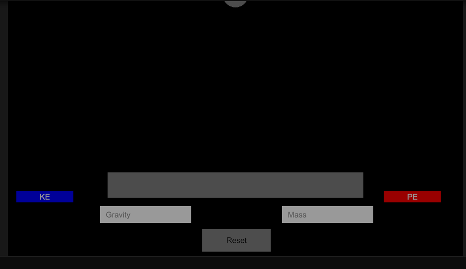
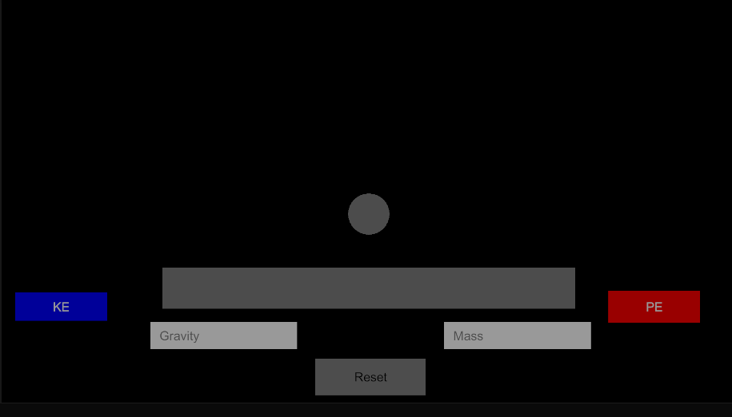

# Bouncing Ball Energy Simulation

This Unity project simulates a bouncing ball to visualize kinetic and potential energy transformations. It includes:

- A bouncing ball that responds to gravity and mass.
- Interactive UI: Adjust gravity and mass values.
- Real-time energy bar charts for Potential Energy (PE) and Kinetic Energy (KE).
- Velocity display.
- Reset button to restart simulation.

## 🎮 Features

- Physics-based motion with adjustable mass and gravity.
- UI built dynamically via SceneBuilder.
- Modular, readable C# scripts.
- Clean, minimalistic UI.

## 🚀 Setup Instructions

1. Open Unity Hub and click **Open**, then select this folder.
2. From the top bar, go to **Tools > Build Bouncing Ball Scene** to auto-generate the layout.
3. Hit **Play** to run the simulation.
4. Use input fields to adjust gravity and ball mass.
5. Click the **Reset** button to restart the simulation.

## 🛠 Requirements

- Unity 2022.3 LTS or newer
- No external packages required (pure Unity)

## 📂 Folder Structure

Assets/
├── Editor/ # Contains SceneBuilder editor script
├── Scripts/ # Main C# scripts (BallController, ResetSimulation, etc.)
├── Materials/ # Physics materials (e.g., bouncy)
├── Scenes/ # Contains demo scenes
├── Prefabs/ # (Optional) UI and object prefabs

## 📸 Demo

